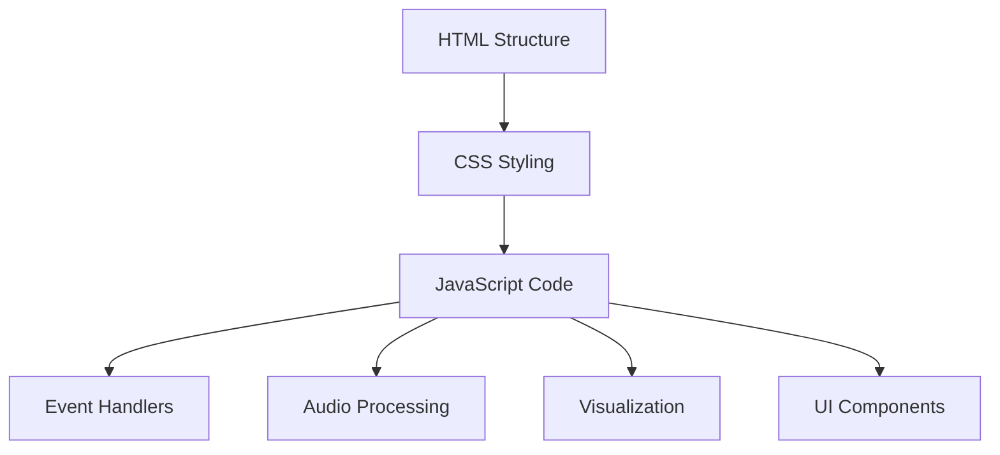
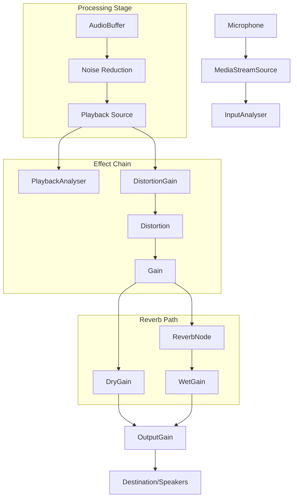
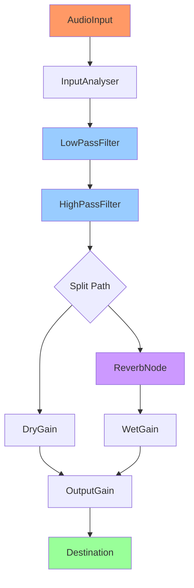
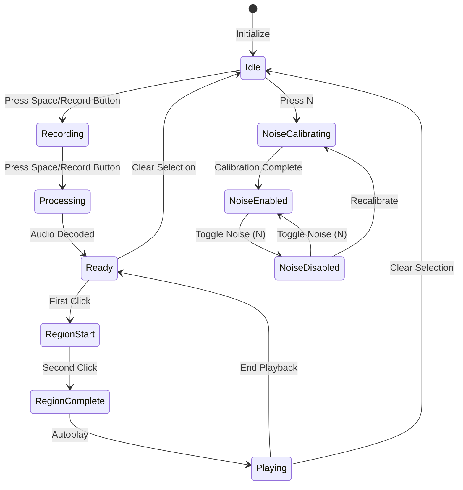

# Hyperphone Granulator - Code Structure

This document provides a detailed explanation of the Hyperphone Granulator codebase structure, design principles, and key components.

## Overall Architecture

The Hyperphone Granulator is built as a single-file web application (`index.html`) containing HTML, CSS, and JavaScript. This design choice was made to ensure portability, ease of deployment, and elimination of external dependencies.

The application follows a modular approach within a single file, with clearly defined sections:



## Code Modules

### 1. Global Variables and Initialization

```javascript
// Global variables for audio context, buffer, recorder, etc.
let audioContext = null, audioBuffer = null, mediaRecorder = null;
// Variables for recording and playback state
let isRecording = false, isPlaying = false, selectedRegion = { start: 0, end: 0 };
// Additional state variables for UI and interactions
```

This section defines all global variables and state management objects used throughout the application.

### 2. UI Initialization

```javascript
document.addEventListener('DOMContentLoaded', init);

async function init() {
  // Initialize canvas, Web Audio API, and UI components
  // Set up event listeners for user interactions
}
```

The initialization function sets up the audio context, creates necessary audio nodes, binds event listeners, and prepares the canvas for visualization.

### 3. Audio Recording and Processing

```javascript
async function startRecording() {
  // Request microphone access
  // Create MediaRecorder and start capturing audio
}

function stopRecording() {
  // Stop recording and process captured audio
}

async function processAudioBlob(blob) {
  // Decode audio data and apply processing
  // Draw waveform and update UI
}
```

This module handles capturing audio from the microphone, converting it to usable audio data, and applying any necessary processing (such as noise reduction).

### 4. Noise Reduction

```javascript
async function calibrateNoise() {
  // Record ambient noise for calibration
}

async function processNoiseProfile(chunks) {
  // Process recorded noise data to create a noise profile
}

function computeNoiseSpectrum(buffer) {
  // Compute frequency spectrum of noise
}

async function denoiseAudio(buffer, noiseProfile) {
  // Apply spectral subtraction noise reduction
}
```

The noise reduction system creates a profile of ambient noise and uses spectral subtraction to remove it from recordings.

### 5. Visualization

```javascript
function drawWaveform() {
  // Render audio waveform on canvas
}

function drawSpectrogram() {
  // Generate and display spectrogram for frequency visualization
}

function drawVuMeter() {
  // Display real-time volume level
}
```

Visualization functions convert audio data into visual representations, including time-domain waveforms and frequency-domain spectrograms.

### 6. Region Selection and Playback

```javascript
function handleCanvasClick(e) {
  // Process mouse/touch interactions for region selection
}

function drawRegion() {
  // Create and display the selected region with handles
}

function playSelection() {
  // Play the selected region with looping
}
```

These functions manage the creation and manipulation of playback regions, including the UI elements for selection and the audio playback logic.

### 7. Effect Processing

```javascript
// FreeVerb implementation
class FreeverbNode extends AudioWorkletProcessor {
  // Implement Schroeder's reverb algorithm
}

function createConvolver() {
  // Fallback reverb using ConvolverNode
}

function makeDistortionCurve(amount) {
  // Create custom distortion curve
}
```

The effects processing section implements various audio effects, including the FreeVerb reverb algorithm and distortion processing.

### 8. Touch and Gesture Handling

```javascript
function handleTouchStart(e) {
  // Process touch interactions based on finger count
}

function handleTouchMove(e) {
  // Handle multi-touch gestures for parameter control
}

function handleTouchEnd(e) {
  // Clean up after touch interactions
}
```

This module manages touch interactions, allowing for rich gesture-based control of various parameters.

### 9. Signal Processing Utilities

```javascript
function fft(real, imag) {
  // Fast Fourier Transform implementation
}

function ifft(real, imag) {
  // Inverse Fast Fourier Transform
}
```

Utility functions for spectral analysis and synthesis, used in noise reduction and spectrogram generation.

## Audio Signal Flow

The audio signal flow in the application follows this path:



## Web Audio API Node Graph



## State Diagram for Application Workflow



## Responsive Design

The application uses CSS media queries and relative sizing to ensure functionality across different screen sizes:

```css
@media (max-width: 768px) {
  .record-button { width: 80px; height: 80px; bottom: 30px; }
  .status, .mode-indicator, .noise-indicator { font-size: 14px; }
}
```

## Key Browser APIs Used

1. **Web Audio API**: Core audio processing capabilities
2. **Canvas API**: Visualization of audio data
3. **MediaRecorder API**: Capture audio from microphone
4. **TouchEvents API**: Handle multi-touch interactions
5. **FullScreen API**: Enable full-screen mode
6. **AudioWorklet API**: Implement custom audio processing (FreeVerb)

## Performance Considerations

- RequestAnimationFrame for efficient rendering
- Canvas optimization for smooth visualization
- Audio buffer management to prevent memory leaks
- Touch event optimization for mobile performance 