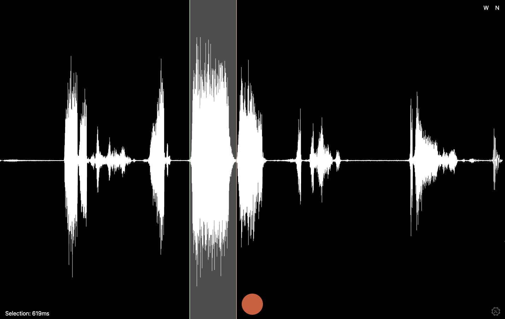

# Hyperphone Granulator (HF Granulator)

A minimalist granular audio processing instrument that works directly in the browser, enabling real-time recording, audio manipulation, and playback with various audio effects.

**Live Demo**: [https://hf-granulator.vercel.app](https://hf-granulator.vercel.app)

## What is a Hyperphone?

A **hyperphone** is an **autonomous** musical entity, with integrated and ubiquitous features where the interface, amplification, and interaction are part of an **inseparable** unit. It's not just a technology-enhanced instrument, but a **new paradigm of sound object**.

A hyperphone:
- Is a unified entity with integrated interface, synthesis, processing, and sound emission
- Is self-amplified, emitting sound from the instrument itself
- Has an interface inseparable from the instrument body (not a floating app)
- Is adaptive and responsive to its environment (motion, gestures, spatial position)
- Plays with spatiality - can be portable, wearable, or networked
- Redefines the musician's physicality, requiring gestural movements or haptic contact
- Is autonomous at all stages, not dependent on external DAWs or processors

## Customization Options

The Hyperphone Granulator provides several parameters you can adjust for unique sonic results:

- **Granular Settings**: 
  - Grain size (controlled by region selection length)
  - Playback rate (speed of grain repetition)
  - Pitch (via two-finger rotation gesture)
  - Time-stretching (via two-finger vertical movement)

- **Effect Parameters**:
  - **Reverb** (FreeVerb algorithm):
    - Room size: 0.0-1.0 (default: 0.8)
    - Dampening: 0.0-1.0 (default: 0.5)
    - Width: 0.0-1.0 (default: 1.0)
    - Wet/dry mix: 0.0-1.0 (default: 0.3/0.7)
  
  - **Filters**:
    - High-pass cutoff: 80Hz
    - Low-pass cutoff: 18kHz

Advanced users can further customize the granulator by modifying the code to adjust these default parameters or add new processing modules to the audio signal chain.

## Features

- **Audio Recording**: Capture audio from your microphone with a single click
- **Waveform Visualization**: See your audio represented visually in real-time
- **Spectrogram View**: Toggle to frequency domain visualization 
- **Two-Click Region Selection**: Create playback regions with simple selection
- **Granular Playback**: Loop selected regions with smooth crossfades
- **Audio Effects**:
  - FreeVerb implementation (Manfred Schroeder algorithm)
  - Distortion and gain control
  - Noise reduction with calibration
- **Touch Gestures**:
  - Multi-touch for reverb control (3 fingers)
  - Two-finger gestures for time-stretching and pitch-shifting
  - Single-touch for region selection and refinement
- **Responsive Design**: Works on desktop and mobile devices

## Keyboard Shortcuts

| Key       | Function                    |
|-----------|----------------------------|
| Space     | Start/Stop recording       |
| R         | Clear current selection    |
| W         | Toggle waveform/spectrogram|
| F         | Enter fullscreen mode      |
| N         | Calibrate noise profile    |

## Mobile Usage

- **Double-tap**: Enter fullscreen (except on control areas)
- **Single-tap**: Select regions or interact with controls
- **Two-finger gesture**: Adjust time-stretching (vertical) and pitch (rotation)
- **Three-finger gesture**: Control reverb parameters
  - Horizontal movement: Adjusts wet/dry mix
  - Vertical movement: Changes reverb duration
- **Tap bottom corners**: Fade out audio and clear selection
- **Tap lower 10% of screen**: Stop audio playback immediately

## Code Structure

The application is organized into several functional modules:

1. **UI and Initialization**
   - Canvas setup and resize handlers
   - Event listeners for user interactions
   - Status indicators and controls

2. **Audio Engine**
   - Web Audio API graph management
   - Audio recording and playback
   - Media stream handling

3. **Signal Processing**
   - FreeVerb (Schroeder algorithm) implementation via AudioWorklet
   - FFT/IFFT for frequency domain analysis and synthesis
   - Noise reduction with spectral subtraction

4. **Visualization**
   - Waveform drawing using Canvas API
   - Spectrogram generation using frequency data
   - Real-time VU meter

5. **Interaction Handling**
   - Mouse and touch event processing
   - Multi-touch gesture recognition
   - Region selection and manipulation

6. **Effects Processing**
   - Reverb implementation (FreeVerb or fallback convolver)
   - Distortion curve generation
   - Gain and filter controls

## Development

The Hyperphone Granulator is designed to work without external dependencies, using native browser APIs:

- Web Audio API for audio processing
- Canvas API for visualization
- Web Audio API's AudioWorklet for advanced effects

## Mobile Web App

The application can be installed as a progressive web app on mobile devices:
1. Open the demo link in your mobile browser
2. Add to home screen
3. Launch as a standalone application

## Debug Information

Mobile debugging is available via the Eruda console - swipe up from the bottom of the screen to access advanced debugging tools.

## License

MIT License 